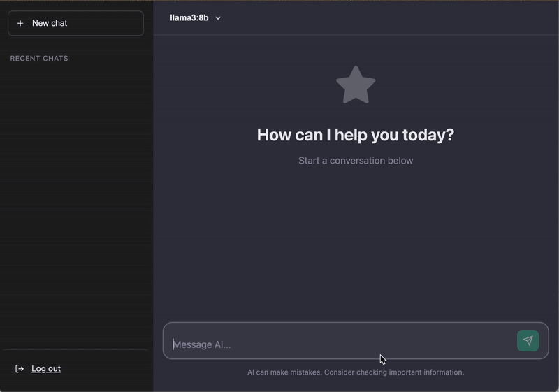

# ⚡ Single-File PHP AI Chat (Ollama & OpenAI)
[](https://buymeacoffee.com/quizmybrai7)


A full-featured AI chat interface that lives in **one single PHP file**. 

No `npm install`. No `docker compose`. No build steps. Just drop `chat.php` on any server (or localhost) and start chatting with **Llama 3** (via Ollama) or **GPT-4** (via OpenAI).



## 🚀 Why this exists?

Modern AI tools are bloated. Running a simple UI for your local LLM often requires installing Node.js, Python, React, and 2GB of dependencies. 

**This project solves that:**
* **Zero Dependencies:** Uses vanilla PHP, jQuery (CDN), and CSS.
* **Portable:** Runs on any shared hosting (Apache/Nginx) or a local potato.
* **Private:** Your data stays on your server (or localhost).
* **Streaming:** Real-time token streaming via Server-Sent Events (SSE).

## ✨ Features

* **Universal Support:** Works with **Ollama** (Local) and **OpenAI** (Cloud).
* **Code Highlighting:** Auto-detects code blocks and applies syntax highlighting.
* **Markdown Support:** Renders rich text, tables, and lists.
* **Chat History:** Saves your conversations locally (in browser `localStorage`).
* **Secure:** Simple password protection included.
* **Responsive:** Works perfectly on mobile and desktop.

## 🛠️ Quick Start

### Option A: Local Llama (Ollama)

1.  Ensure [Ollama](https://ollama.com/) is running.
2.  Download `chat.php`.
3.  Open the file and edit the configuration at the top:
    ```php
    $apiKey  = 'ollama'; 
    $baseUrl = '[http://127.0.0.1:11434/v1](http://127.0.0.1:11434/v1)'; // Use 127.0.0.1 for local reliability
    $model   = 'llama3:8b'; // Match the model you pulled
    ```
4.  Run a local PHP server in your terminal:
    ```bash
    php -S localhost:8000
    ```
5.  Open `http://localhost:8000/chat.php`

### Option B: OpenAI (ChatGPT)

1.  Download `chat.php`.
2.  Edit the configuration at the top:
    ```php
    $apiKey  = 'sk-proj-...'; // Your OpenAI Key
    $baseUrl = '[https://api.openai.com/v1](https://api.openai.com/v1)';
    $model   = 'gpt-4o-mini';
    ```
3.  Upload to any PHP web host.

## ⚙️ Configuration

All settings are located at the very top of `chat.php`:

```php
// Security
define('ACCESS_PASSWORD', 'secret'); // ?pwd=secret to login

// API Config
$apiKey  = '...';
$baseUrl = '[http://127.0.0.1:11434/v1](http://127.0.0.1:11434/v1)'; 
$model   = 'llama3';
```
## ☕ Support the Project

If you found this tool useful, you can buy me a coffee to keep me awake while I code the next feature!

<a href="https://buymeacoffee.com/quizmybrai7">
  
</a>
